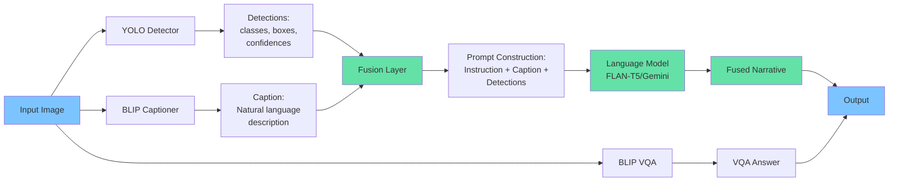
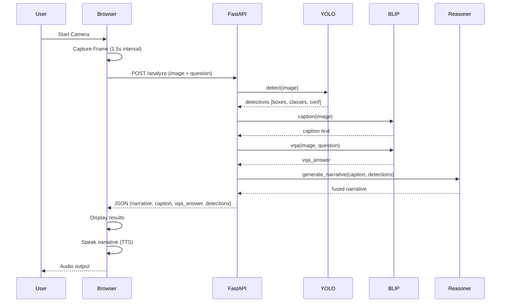
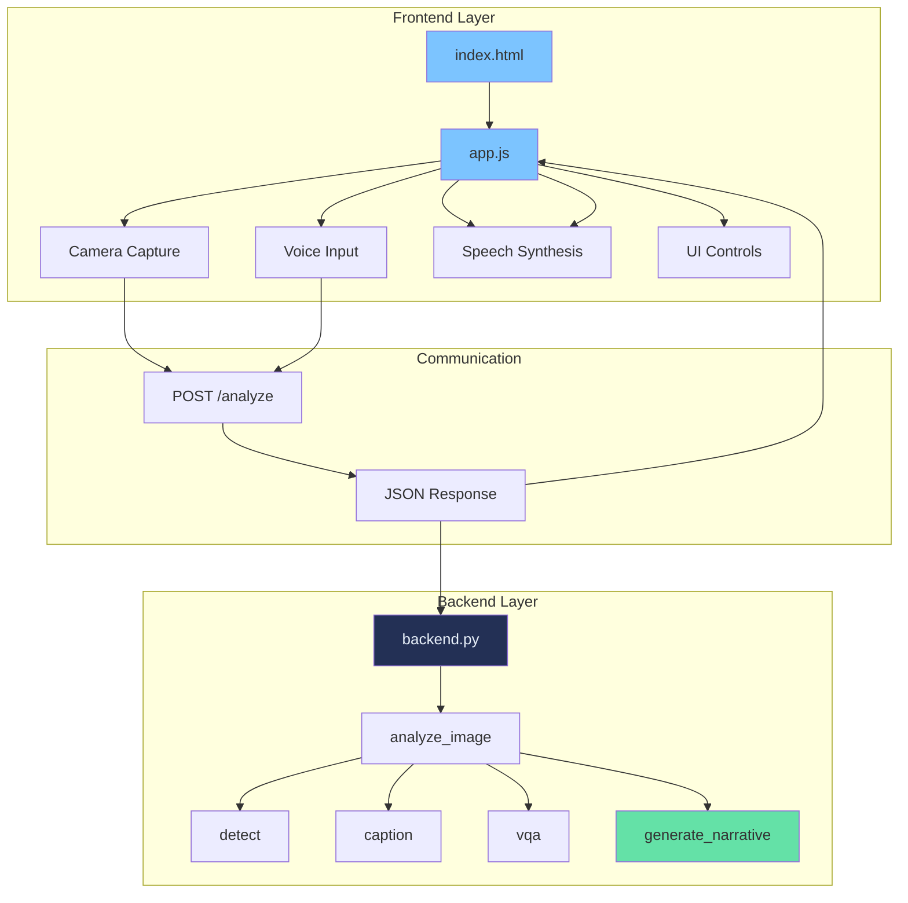
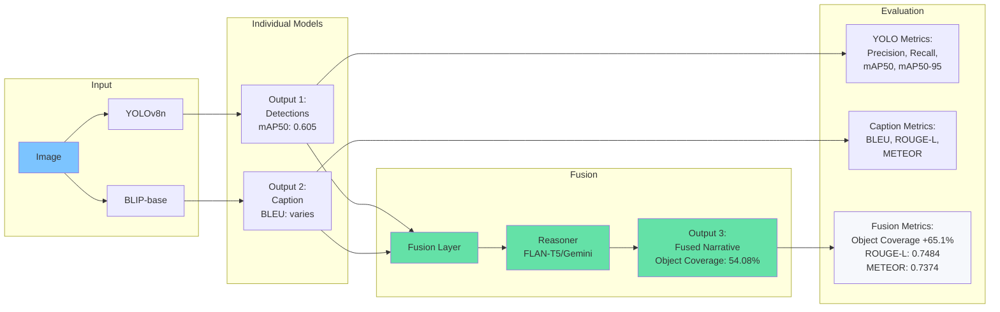
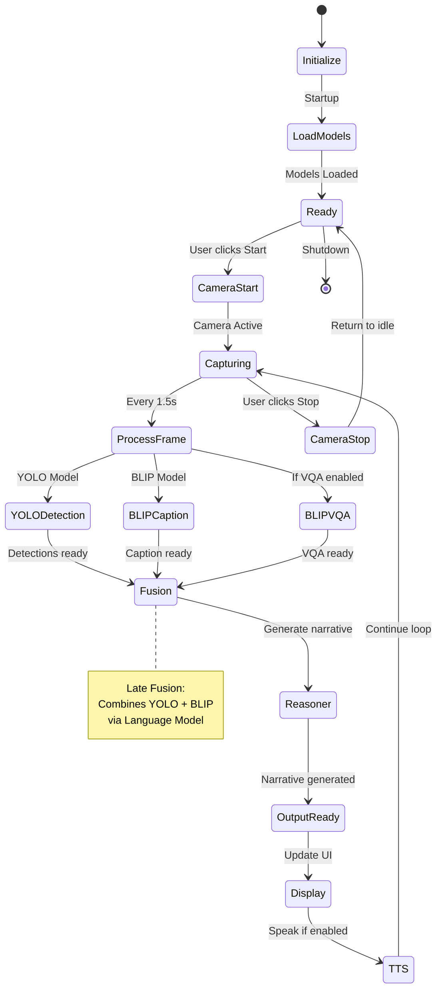

# VISOR Architecture Diagrams

## 1. System Architecture Overview

**Explanation**: This diagram provides a high-level view of the entire VISOR system architecture. It shows the four main subsystems:

- **Frontend Layer**: The web browser interface where users interact with the camera feed, controls, and receive audio output through text-to-speech
- **Backend API**: The FastAPI server that handles HTTP requests and coordinates image processing
- **Vision Models**: The parallel processing of YOLOv8 for object detection, BLIP for image captioning, and BLIP VQA for question answering
- **Fusion Layer**: The critical component that combines YOLO detections and BLIP captions through a language model reasoner (FLAN-T5 or Gemini 2.5 Flash) to generate a unified narrative

The diagram illustrates how data flows from the frontend camera capture through the backend processing pipeline, with the fusion layer acting as the synthesizer that combines multiple model outputs into a single, coherent description optimized for assistive technology applications.

```mermaid
graph TB
    subgraph "Frontend"
        A[Web Browser] --> B[Camera Feed]
        B --> C[Frame Capture]
        C --> D[UI Controls]
        D --> E[Text-to-Speech]
    end
    
    subgraph "Backend API"
        F[FastAPI Server] --> G[/analyze endpoint]
        G --> H[Image Processing]
    end
    
    subgraph "Vision Models"
        H --> I[YOLOv8 Detection]
        H --> J[BLIP Captioning]
        H --> K[BLIP VQA]
    end
    
    subgraph "Fusion Layer"
        I --> L[Detection Summarization]
        J --> L
        L --> M[FLAN-T5/Gemini Reasoner]
        M --> N[Fused Narrative]
    end
    
    C --> F
    N --> G
    G --> A
    A --> E
    
    style A fill:#7cc4ff
    style F fill:#233055,color:#e6eef8
    style M fill:#64e1a7
    style N fill:#64e1a7
```

## 2. Multimodal Fusion Pipeline

**Explanation**: This flowchart details the late fusion architecture that is the core innovation of VISOR. The diagram shows:

- **Parallel Processing**: A single input image is processed simultaneously by three independent models (YOLO, BLIP Captioner, BLIP VQA)
- **Output Formatting**: YOLO produces structured detection data (classes, bounding boxes, confidence scores), while BLIP generates natural language descriptions
- **Fusion Process**: The fusion layer takes both structured detections and natural language captions, constructs an instruction-following prompt, and feeds it to a language model
- **Reasoning**: The language model (FLAN-T5 or Gemini 2.5 Flash) synthesizes a new narrative that combines information from both sources
- **Output**: The final fused narrative is more comprehensive than either input alone, mentioning detected objects while maintaining natural language structure

This diagram is essential for understanding how VISOR achieves +65.1% improvement in object coverage while maintaining semantic quality (ROUGE-L: 0.7484).



## 3. Data Flow Diagram

**Explanation**: This sequence diagram shows the temporal flow of data through the system during a single analysis request. It demonstrates:

- **User Interaction**: The sequence starts when a user starts the camera and captures frames at regular intervals (typically 1.5 seconds)
- **Request Processing**: Each frame is sent to the FastAPI backend along with an optional question for VQA
- **Parallel Model Execution**: The backend processes the image through three models concurrently (though shown sequentially for clarity):
  - YOLO for object detection
  - BLIP for caption generation
  - BLIP VQA for question answering (if a question is provided)
- **Fusion Step**: After receiving both detections and caption, the fusion layer generates a narrative
- **Response Cycle**: The complete response (narrative, caption, VQA answer, detections) is returned to the frontend, displayed to the user, and spoken via text-to-speech

This diagram is useful for understanding latency, timing, and the sequence of operations in the real-time processing pipeline.



## 4. Frontend-Backend Interaction

**Explanation**: This component diagram illustrates the layered architecture and how different parts of the system communicate:

- **Frontend Layer**: Built with vanilla HTML/JavaScript, handling camera capture, voice input via Web Speech API, speech synthesis for output, and UI controls (toggles, buttons, status displays)
- **Communication Layer**: HTTP POST requests to `/analyze` endpoint with FormData containing image and optional question, returning JSON responses with all analysis results
- **Backend Layer**: Python-based FastAPI server that orchestrates the analysis pipeline by calling individual functions (detect, caption, vqa, generate_narrative)

The diagram emphasizes the clean separation of concerns: the frontend handles user interaction and media, while the backend focuses on AI model inference and fusion logic. This separation allows for easy deployment, testing, and potential future mobile app development.



## 5. Model Pipeline & Evaluation

**Explanation**: This diagram shows both the processing pipeline and the evaluation metrics associated with each stage:

- **Input Processing**: A single image enters two parallel pipelines (YOLO and BLIP)
- **Individual Model Outputs**: 
  - YOLO produces detections with performance metrics (mAP50: 0.605 for yolov8n)
  - BLIP generates captions that can be evaluated with standard NLP metrics
- **Fusion Layer**: Combines both outputs through a reasoning model to create a unified narrative
- **Fusion Output**: The fused narrative demonstrates improved object coverage (54.08% vs 32.75% for BLIP alone, representing a +65.1% improvement) while maintaining semantic quality (ROUGE-L: 0.7484, METEOR: 0.7374)
- **Evaluation Metrics**: Each stage has associated quantitative metrics that validate the system's performance

This diagram is particularly valuable for understanding the quantitative benefits of fusion and how the system balances multiple objectives (object detection completeness, natural language quality, semantic accuracy).



## 6. Complete System Workflow

**Explanation**: This state machine diagram captures the complete lifecycle of the VISOR system from startup to shutdown:

- **Initialization States**: System starts, loads all models (YOLO, BLIP, reasoner), and enters a ready state
- **Active Processing Loop**: When the user starts the camera, the system enters a continuous capture loop:
  - Frames are processed every 1.5 seconds (configurable)
  - Each frame goes through YOLO detection, BLIP captioning, optional VQA, and fusion
  - Results are displayed and optionally spoken
  - The loop continues until the user stops the camera
- **State Transitions**: Clear transitions between idle (Ready), active (Capturing), processing (YOLODetection, BLIPCaption, Fusion, Reasoner), and output (Display, TTS)
- **Fusion Note**: The diagram includes a note explaining that late fusion combines YOLO and BLIP outputs via a language model

This diagram is essential for understanding the system's operational states, error handling boundaries, and how the continuous processing loop works in a real-time assistive technology application.



## Usage

These diagrams can be:
- Embedded in documentation (GitHub README, project docs)
- Exported as images using Mermaid Live Editor (https://mermaid.live)
- Included in presentations
- Added to the fusion report PDF (converted to images)

## Diagram Descriptions

1. **System Architecture**: Overall system components and their relationships
2. **Multimodal Fusion Pipeline**: Detailed fusion process showing how models combine
3. **Data Flow**: Sequence diagram showing request/response flow
4. **Frontend-Backend Interaction**: Component interactions across layers
5. **Model Pipeline & Evaluation**: Models with their evaluation metrics
6. **Complete System Workflow**: State machine showing system states and transitions

