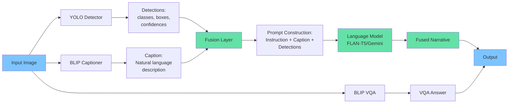
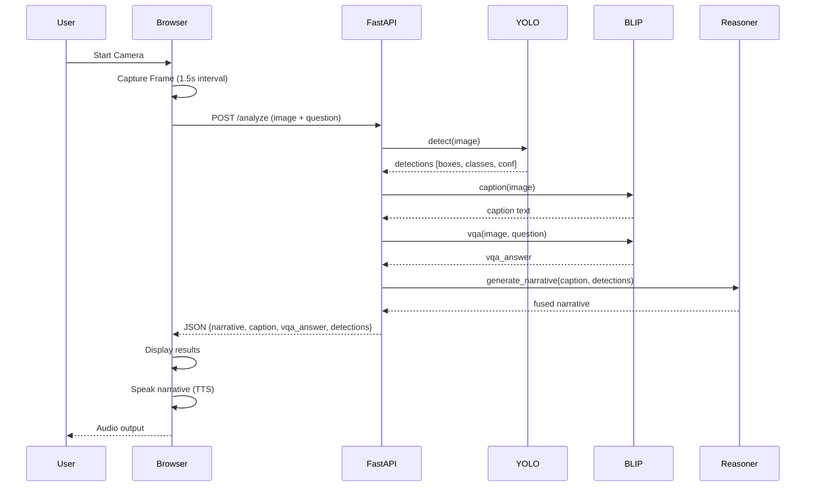
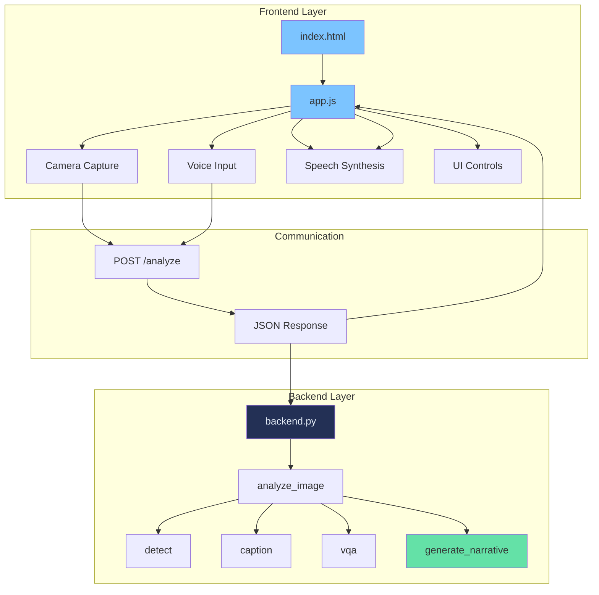
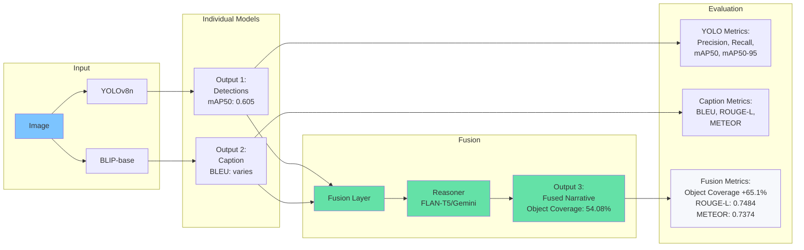
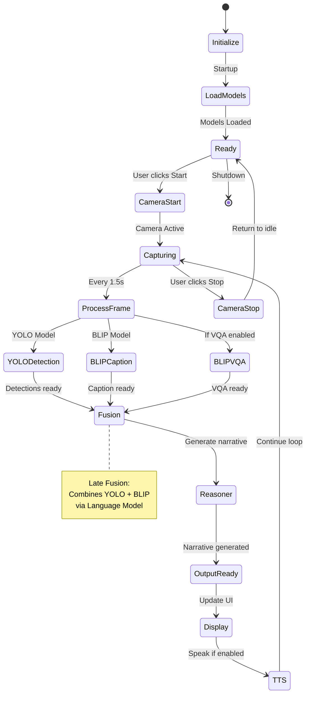

# VISOR Architecture Diagrams

## 1. System Architecture Overview

```mermaid
graph TB
    subgraph "Frontend"
        A[Web Browser] --> B[Camera Feed]
        B --> C[Frame Capture]
        C --> D[UI Controls]
        D --> E[Text-to-Speech]
    end
    
    subgraph "Backend API"
        F[FastAPI Server] --> G[/analyze endpoint]
        G --> H[Image Processing]
    end
    
    subgraph "Vision Models"
        H --> I[YOLOv8 Detection]
        H --> J[BLIP Captioning]
        H --> K[BLIP VQA]
    end
    
    subgraph "Fusion Layer"
        I --> L[Detection Summarization]
        J --> L
        L --> M[FLAN-T5/Gemini Reasoner]
        M --> N[Fused Narrative]
    end
    
    C --> F
    N --> G
    G --> A
    A --> E
    
    style A fill:#7cc4ff
    style F fill:#233055,color:#e6eef8
    style M fill:#64e1a7
    style N fill:#64e1a7
```

## 2. Multimodal Fusion Pipeline



## 3. Data Flow Diagram



## 4. Frontend-Backend Interaction



## 5. Model Pipeline & Evaluation



## 6. Complete System Workflow



## Usage

These diagrams can be:
- Embedded in documentation (GitHub README, project docs)
- Exported as images using Mermaid Live Editor (https://mermaid.live)
- Included in presentations
- Added to the fusion report PDF (converted to images)

## Diagram Descriptions

1. **System Architecture**: Overall system components and their relationships
2. **Multimodal Fusion Pipeline**: Detailed fusion process showing how models combine
3. **Data Flow**: Sequence diagram showing request/response flow
4. **Frontend-Backend Interaction**: Component interactions across layers
5. **Model Pipeline & Evaluation**: Models with their evaluation metrics
6. **Complete System Workflow**: State machine showing system states and transitions

